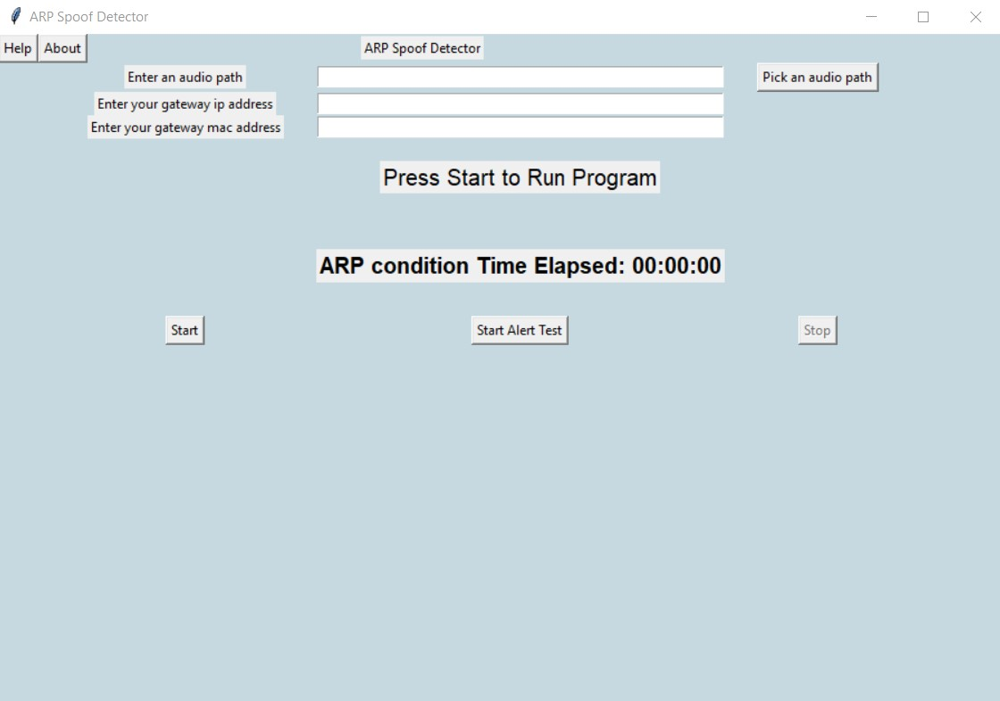
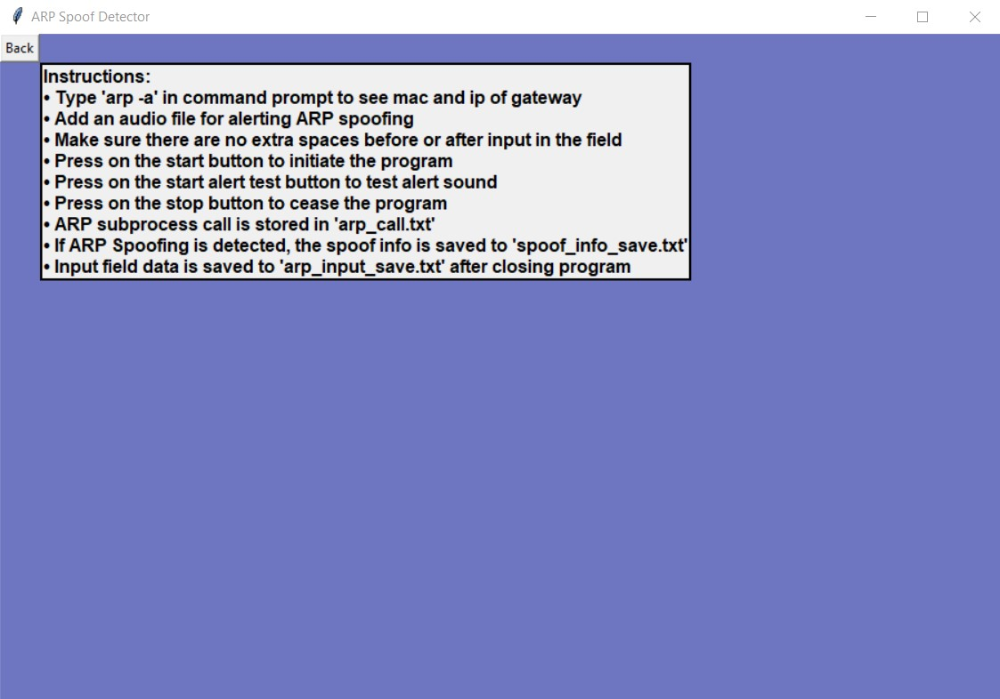

# Tkinter_ARP_Spoof_Detector
 A Tkinter application that detects ARP Spoofing
 
 
 ## Info:
 
Made with Python 3.8.1 and tkinter 8.6

 
 #### Uses pygame mixer:
 
 pip install pygame 

 
 
 ## Screenshots: 
<h3 align = "center"> Main App Screen </h3>
 

  

 

 <h3 align = "center"> Help Screen </h3>
 
 
 

